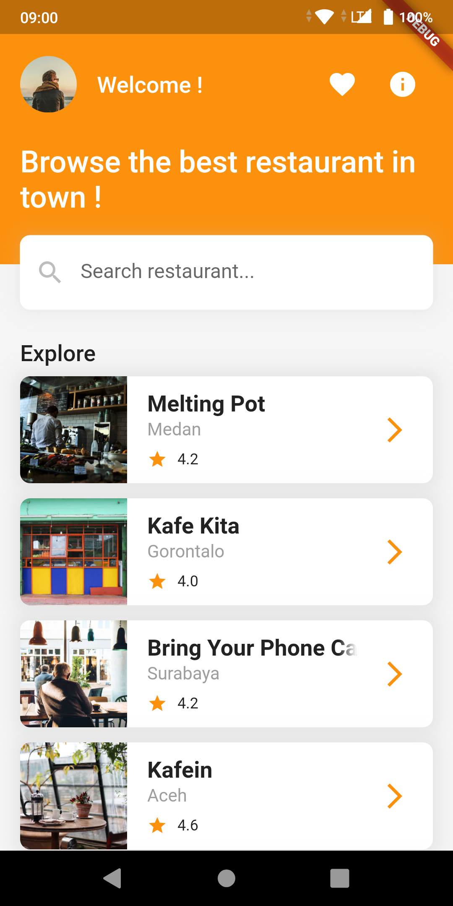
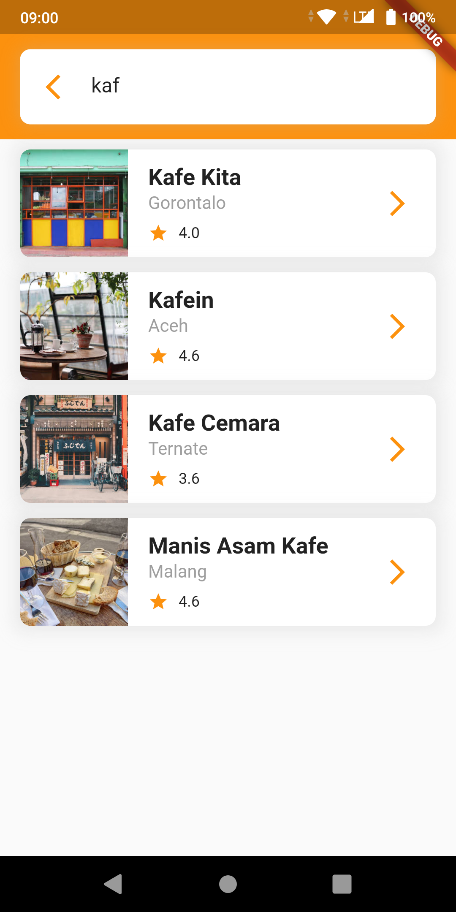
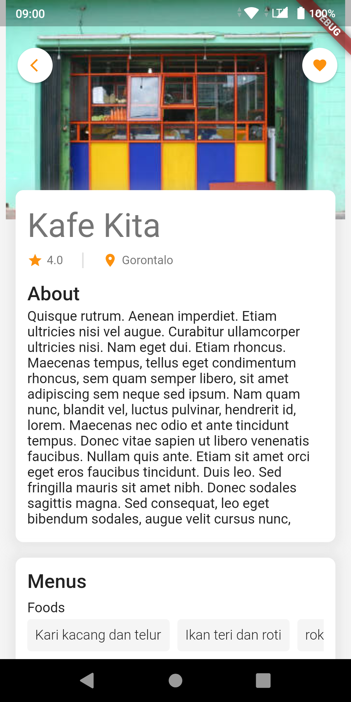
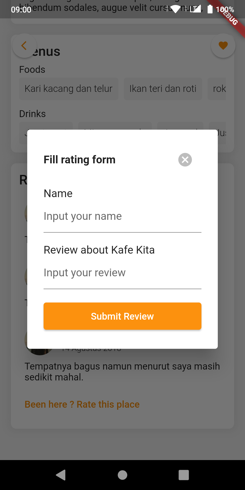

## restauran_app 
### Submission for Dicoding Belajar Fundamental Aplikasi Flutter

Tech Stack:
1. Flutter
2. [Provider](https://pub.dev/packages/provider) for State Management
3. [http](https://pub.dev/packages/http) for Rest API 
4. [sqflite](https://pub.dev/packages/sqflite) for Local Database
5. [flutter_local_notification](https://pub.dev/packages/flutter_local_notifications) for Notification 
6. [android_alarm_manager](https://pub.dev/packages/android_alarm_manager_plus) plus for Alarm

### Preview
|||
|--------------------------------------------------------------|--------------------------------------------------------------|
|                     Preview 1                                |                          Preview 2                           |
|||
|                     Preview 3                                |                          Preview 4                           |

Star this repository would be really appreciated :DD
